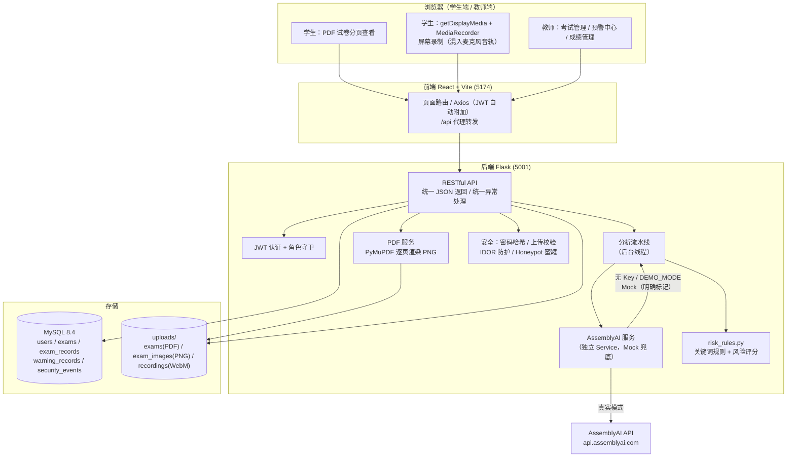
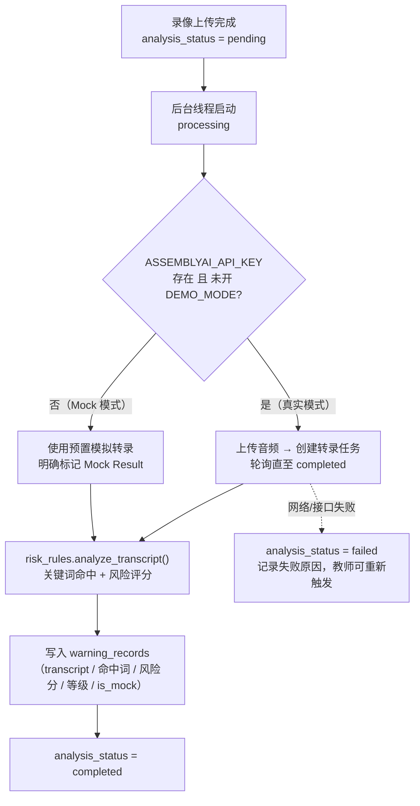

# 系统架构（中期检查版）

> 本文档描述"基于 AssemblyAI 的考试预警系统"当前已实现的真实架构，所有内容与代码一致。

## 1. 项目介绍

本项目是一个面向在线考试场景的 **考试过程风险预警系统**。学生在浏览器中参加考试并录制屏幕过程；考试录像提交后，系统调用 **AssemblyAI** 完成语音转文字，基于关键词规则与可解释的风险评分生成"考试行为预警"，供教师复核参考。

> 重要原则：AI 风险结果仅作为 **考试行为预警 / 教师复核依据**，系统不直接判定学生作弊。

## 2. 技术架构

| 层次 | 技术选型 |
| ---- | ---- |
| 前端 | React 18 + Vite + React Router + Axios（原生 CSS） |
| 后端 | Python Flask + Flask-SQLAlchemy + Flask-JWT-Extended + Flask-CORS |
| 数据库 | MySQL 8.4（SQLAlchemy ORM，可退回 SQLite） |
| PDF 解析 | PyMuPDF（逐页渲染 PNG） |
| 语音转写 | AssemblyAI Speech-to-Text（纯 HTTP 集成，无 SDK 依赖） |
| 录制 | 浏览器 getDisplayMedia + MediaRecorder（WebM） |
| 认证 | JWT（登录态 24h），角色：teacher / student |

## 3. 系统架构图

## 4. 功能模块（均已实现并运行验证）

| 模块 | 说明 |
| ---- | ---- |
| 用户认证 | JWT 登录、角色（教师/学生）、登录态保持、失效自动跳转登录页 |
| 教师考试管理 | 创建考试（上传 PDF）、编辑、发布、考试列表 |
| PDF 试卷服务 | PyMuPDF 逐页渲染 PNG，学生端分页查看（上一页/下一页/页码） |
| 在线考试 | 学生进入考试、查看试卷、提交考试 |
| 屏幕录制 | getDisplayMedia + MediaRecorder，屏幕音轨 + 麦克风混音，WebM 上传 |
| AssemblyAI 转录 | 独立 Service；无 Key / 网络不可用时进入 Mock 模式（明确标记） |
| 异常关键词检测 | risk_rules.py 统一维护规则；长词优先匹配防重复计分 |
| 风险评分 | 可解释评分（询问答案 +20、可疑行为 +10、单词封顶 3 次、总分封顶 100），低/中/高三级 |
| 风险预警 | warning_records 落库；教师预警中心列表 + 详情 + 复核意见 |
| 成绩管理 | 教师手工录入/修改成绩 |
| 安全机制 | 密码哈希、JWT 角色守卫、上传类型/大小/随机文件名校验、ORM 防 SQL 注入、IDOR 防护、Honeypot 蜜罐（隐藏字段 + 诱捕接口） |

## 5. 核心流程

### 5.1 考试与预警主链路

```mermaid
flowchart LR
    A[教师登录] --> B[创建考试<br/>上传 PDF]
    B --> C[PyMuPDF 渲染<br/>试卷页面 PNG]
    C --> D[发布考试]
    D --> E[学生登录]
    E --> F[进入考试<br/>创建考试记录]
    F --> G[允许屏幕共享<br/>开始录制]
    G --> H[浏览试卷作答]
    H --> I[提交考试]
    I --> J[停止录制<br/>WebM 上传]
    J --> K[ffmpeg 提取音轨]
    K --> L[AssemblyAI 转录]
    L --> M[关键词规则检测<br/>风险评分]
    M --> N[生成 warning_record]
    N --> O[教师预警中心<br/>查看详情 / 复核]
```

### 5.2 AI 分析流程与状态机

考试记录的分析状态：`pending → processing → completed / failed`

### 5.3 风险评分规则

- 询问答案类关键词（如"答案是什么""选什么""这题怎么做"）：**+20 分/次**
- 可疑行为类关键词（如"百度一下""你帮我看""第几题"）：**+10 分/次**
- 同一关键词最多累计 3 次；总分上限 100
- 等级：0–29 低风险 / 30–59 中风险 / 60–100 高风险

## 6. 安全设计

1. **密码**：Werkzeug PBKDF2 哈希存储，禁止明文
2. **认证鉴权**：JWT + `role_required` 角色守卫，教师/学生接口隔离
3. **SQL 注入**：统一 SQLAlchemy ORM，禁止拼接 SQL
4. **文件上传**：白名单扩展名 + 大小限制 + UUID 随机文件名 + `basename` 归一化防路径穿越
5. **IDOR 防护**：考试记录/录像/预警访问均校验"本人或该考试创建教师"
6. **Honeypot 蜜罐**：考试页隐藏字段（正常界面永不填写）+ 诱捕接口 `/api/admin/backup-keys`，触发即记录 security_events 并在教师 Dashboard 展示

## 7. API 不可用时的降级策略（诚实标注原则）

- `ASSEMBLYAI_API_KEY` 为空 → 自动 Mock 模式
- `DEMO_MODE=true` → 强制 Mock 模式（现场演示兜底）
- Mock 结果在数据库（`is_mock`）、接口（`analysis_note`）与前端界面（"⚠ Demo 模拟分析"徽标）三处**明确标记**，绝不伪装成真实 AssemblyAI 返回
- 配置真实 Key 后无需改代码即切回真实接口
