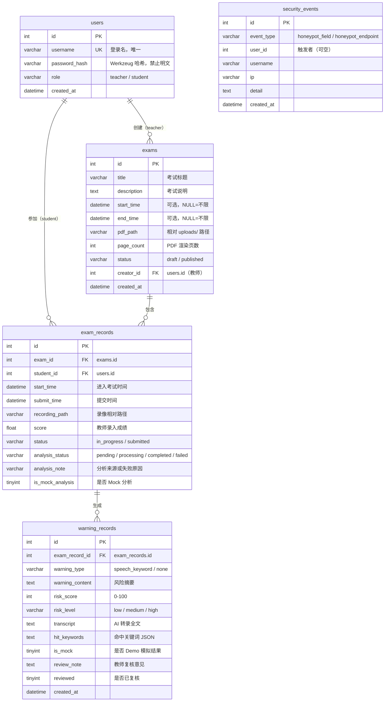

# 数据库设计说明

> ORM：SQLAlchemy（开发/演示使用 MySQL 8.4，`.env` 修改 `DATABASE_URL` 可切换 SQLite）。
> 建库脚本：`scripts/init_mysql.sql`，建表由 `db.create_all()` 自动完成。

## 1. ER 图



## 2. 表功能说明

| 表 | 功能 |
| ---- | ---- |
| `users` | 系统用户（教师/学生），密码哈希存储 |
| `exams` | 考试及其 PDF 试卷信息，draft → published |
| `exam_records` | 学生考试过程记录：进入/提交时间、录像、成绩、AI 分析状态机 |
| `warning_records` | AI 分析生成的风险预警：转录、命中关键词、风险分与等级、教师复核 |
| `security_events` | Honeypot 蜜罐触发的安全事件日志 |

## 3. 关键字段说明

### exam_records.analysis_status（AI 分析状态机）

| 值 | 含义 |
| ---- | ---- |
| pending | 已提交录像，排队等待分析 |
| processing | 后台线程正在转录/评分 |
| completed | 分析完成（结果见 warning_records） |
| failed | 分析失败（analysis_note 记录原因，教师可重新触发） |

### warning_records 风险字段

- `risk_score`：0–100，规则见 `docs/architecture.md` 5.3
- `risk_level`：low（0–29）/ medium（30–59）/ high（60–100）
- `hit_keywords`：JSON 数组，元素形如
  `{"keyword": "答案是什么", "count": 2, "counted": 2, "category": "asking_answer", "category_label": "询问答案", "weight": 20, "points": 40}`
- `is_mock`：`true` 表示 Demo 模拟分析结果（三处标记之一）

## 4. 初始化

```bash
# 1. 建库（首次）
mysql -u root < scripts/init_mysql.sql

# 2. 建表（应用启动时自动 db.create_all()）+ 写入演示数据
cd backend
python seed.py
```
